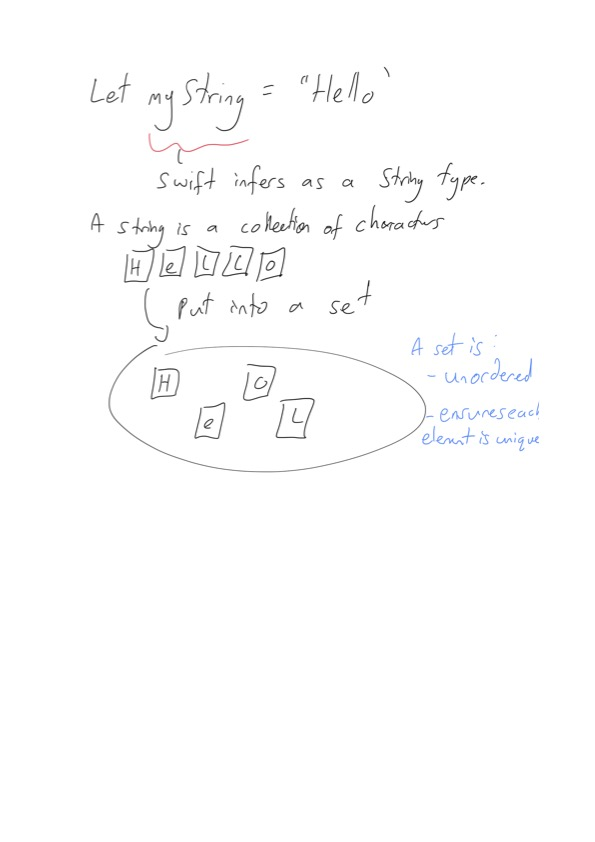

# Is Unique
## Starting off a problem set

Difficulty: **Beginner** | Easy | Normal | Challenging<br/>

This challenge is about `Array` and `Strings` but is not particularly challenging if we choose to use Swift for our solutions.

# The question
Implement an algorithm to determine if a string has all unique characters. What if you cannot use additional data structures.

# Extra resources
swiftdoc has some information around complexity:
https://swiftdoc.org/v5.1/type/array/#content

Dealing with unicode scalars:
https://stevenpcurtis.medium.com/strings-and-characters-in-swift-behind-the-scenes-e29bdc4d23a6

# Solutions
## Using a set
A [set](https://medium.com/swlh/sets-in-swift-94cea4dd7c9f) can be initialized with any element that conforms to Hashable (which the String type does conform to).

A set ensures that each element in the set appears exactly once in the collection, and is suitable as we do not need to preserve the order.

```swift
let myString = "Hello"
let set = Set(myString) // {"e", "o", "H", "l"}
```



Advantages:
- Easy to implement
- Constant time

Disadvantages:
- May not be the answer the interviewer is looking for, particularly if they are from a Java background
- Requires an additional data structure, which is the follow-up question suggested in the book

## Using a brute-force approach
This is a slow brute-force solution, and by it's nature it is slow. 

For each letter in the String, move along the other letters

Advantages:
- Relatively easy to implement

Disadvantages:
- O(n)

**Note:  to subscript Strings**
It should be noted that in Swift it is not possible to subscript a String using an `Int`. this has led me to producing two different versions of this answer for Swift. 

Let us take a simple example. Something like the following:

```swift
let myString = "Hello"
myString[i]
```
gives a compiler error:

```swift
'subscript(_:)' is unavailable: cannot subscript String with an Int, use a String.Index instead.

Swift.String:3:12: note: 'subscript(_:)' has been explicitly marked unavailable here
    public subscript(i: Int) -> Character { get }
           ^
```

To overcome this we have two choices. We can use index which itself is an O(n) operation each time it is used:

```swift
let location = 0
myString[myString.index(myString.startIndex, offsetBy: location)]
```

An alternative is to convert the string to an array.

```swift
let stringArray = Array(myString)
stringArray[0] // legal
```

`stringArray` takes on the type `stringArray: [String.Element]` which has the type `[String.Element]`. We are not able to subscript the array, and the action of converting the string to the array is a one-off O(n) cost. Further subscripts have a complexity of `O(1)`.

**Index solution**

```swift
let myString = "Hello"
for i in 0..<myString.count - 1 {
    for j in i + 1..<myString.count {
        if myString[myString.index(myString.startIndex, offsetBy: i)]
            ==
           myString[myString.index(myString.startIndex, offsetBy: j)] {
            // all characters are not unique
        }
    }
}
``` 

this solution is `O(n²)` due to the nested loop. Auxiliary Space: O(1)

**Array solution**

```swift
let myString = "Hello"
let stringArray = Array(myString)
for i in 0..<stringArray.count - 1 {
    for j in i + 1..<stringArray.count - 1 {
        if stringArray[i] == stringArray[j] {
            print("false \(stringArray[i]) \(stringArray[j]))")
        }
    }
}
```

this solution is `O(n²)` due to the nested loop. Auxiliary Space: O(1)

## Using an array of boolean values
Cracking the coding interview generally likes solutions where you create an array of boolean values and flag whether the character is contained in the string.

**ASCII or not?**

The cracking the coding interview recommends asking if the string is an ASCII or Unicode string. Swift's `Character` is made up of one or more Unicode scalar values, and is able to store emoji and not just the ASCII codes. 

If we take a look at the `Unicode.Scalar` instance of three characters we can get the idea:
F = 70
l = 108
💐 = 128114

It would be good to be aware that some characters are made from one than one Unicode value, although this is really outside of the scope of the question.

```swift
let flag = "🇵🇷"
for v in flag.unicodeScalars {
    print(v.value)
}
// 127477
// 127479
```

ASCII codes are 128 values, so we can use a 128 - length array to represent our booleans. This question would usually be asked about ASCII characters, but it is always good to check.

**Swift ASCII**
Characters have an `asciiValue` property, so can return the `UInt8` as required. However `UInt8` is not the same as `Int`, so cannot directly index the Array.

We can however cast a `UInt8` to a `Int` but this does create some difficult to read code with optionals.

Using index:
```swift
let myString = "Hello"
var booleanArray = Array(repeating: false, count: 256)
for i in 0..<myString.count - 1 {
    let character = myString[myString.index(myString.startIndex, offsetBy: i)]
    if let value = Unicode.Scalar(String(character))?.value {
        if booleanArray[Int(value)] == true {
            // string is not unique
        }
        booleanArray[Int(value)] = true
    }
}
```

Using Array:
```swift
for i in 0..<myString.count - 1 {
    let character = stringArray[i]
    if let value = Unicode.Scalar(String(character))?.value {
        if booleanArray[Int(value)] == true {
            // string is not unique
        }
        booleanArray[Int(value)] = true
    }
}
```

Since Swift's strings are built from Unicode scalars we can use that fact to index our array. This gives the same two variants of the solution

```swift
for i in 0..<myString.count - 1 {
    let character = myString[myString.index(myString.startIndex, offsetBy: i)]
    if let value = character.asciiValue {
        if booleanArray[Int(value)] == true {
            // string is not unique
        }
        booleanArray[Int(value)] = true
    }
}

for i in 0..<myString.count - 1 {
    let character = stringArray[i]
    if let value = character.asciiValue {
        if booleanArray[Int(value)] == true {
            // string is not unique
        }
        booleanArray[Int(value)] = true
    }
}
```

## A dictionary
One of my go-to solutions is to use a dictionary and record the number of each character stored at any given point.

This has the advantage that the dictionary can store the type `String.Element`.

```swift
var freq: [String.Element: Int] = [:]
for i in 0..<stringArray.count - 1 {
    if freq[stringArray[i]] ?? 0 > 0 {
        print("false")
    }
    freq[stringArray[i], default: 0] += 1
}
``` 

The check for elements in the dictionary is typically just O(1). Insertion of values is also typically O(1). Since we traverse the array once, we are looking at O(n)


## Regex 
It's unusual to find an interviewer who will be able to parse regex during the session. Here is a regex that will work withouh a structure

```swift
let regex = /^(?:([A-Za-z])(?!\1))*$/
"Helo".firstMatch(of: regex) != nil // true
"Hello".firstMatch(of: regex) != nil // false
"HeloH".firstMatch(of: regex) != nil // false
```

`^(?:([A-Za-z])(?!\1))*$` roughly means: from the beginning of the line greedily match 


*?: non-capturing group
( Capturing group #1
[ Match in the character set
   A-Z Range
   a-z Range
]
(?! Negative lookahead.
    /1 Numeric reference (matches the result of capture group #1)
)
* Quantifier Match 0 or more of the preceeding token
$ End match the end of the String

Explanation from https://regexr.com

## Bitwise shift
I'm actually unclear why this clever solution is in the book. It carries an extra restriction of only working with a lowercase input string.

Essentially we use a 32bit integer as our Array. Imagine that the number looks something like:

00000000000000000000000000000000

We might store occurrences of "a" in position 0, "b" in position 1 and so on.

We could use the `asciiValue` property of characters to find the value of each character of the input string in turn, and derive our index from the indexValue asciiValue minus the asciiValue of "a".

We can check if the checker "array" is turned on (>0) with a bitwise AND at that index `if ((checker & (1 << index)) > 0)`.
Then of course we need to turn on that value through the use of a bitwise AND `checker = checker | (1 << index)`

```swift
let lowercaseStringArray = Array("hello")
var checker: UInt32 = 0
for i in 0..<lowercaseStringArray.count {
    if let indexValue = lowercaseStringArray[i].asciiValue, let aValue = Character("a").asciiValue {
        let index = indexValue - aValue
        if ((checker & (1 << index)) > 0) {
            // string is not unique
        }
        checker = checker | (1 << index)
    }
}
```
