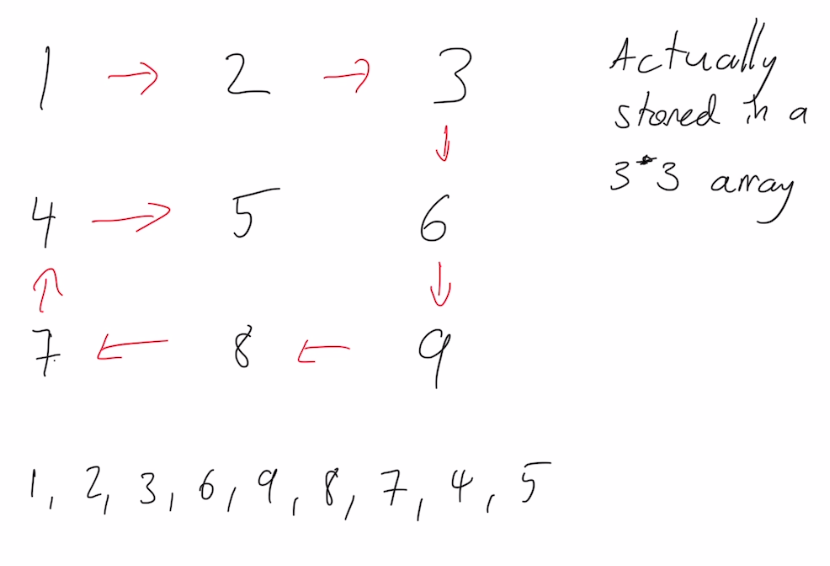

# Matrix

## Rows and columns

If you wish to select an element in a matrix, choose the row before the column.

| A | B |
|---|---|
| C | D |

so
```swift
grid[0][0] == "A"
grid[0][1] == "B"
grid[1][0] == "C"
grid[1][1] == "D"
```

*Iterate over rows*
Using a for loop:
`for row in grid`
Using an index:
`for i in 0..<grid.count`

*Iterate over columns*
Using a for loop
`for column in 0..<grid[0].count`
Using an index:
```swift
for i in 0..<grid[0].count {
    for j in 0..<grid.count {
        let element = grid[j][i]
    }
}
```

*stride*
It can be useful to use stride. Through includes all of the elements but to is exclusive. Choose carefully!

## Spiral Matrix
Given an m x n matrix, return all elements of the matrix in spiral order.

<br>

There are several good solutions to this problem. Using stride can produce the following code:

```swift
final class MyCode {
    func spiralOrder(_ matrix: [[Int]]) -> [Int] {
        guard matrix.count > 0 else {return []}
        var minRow = 0
        var maxRow = matrix.count - 1
        var minCol = 0
        var maxCol = matrix[0].count - 1
        var output : [Int] = []
        let matrixSize = matrix[0].count * matrix.count
        
        while minRow <= maxRow && minCol <= maxCol {
            guard matrixSize > output.count else { return output }
            for j in stride(from: minCol, through: maxCol, by: 1) where minRow <= maxRow {
                output.append(matrix[minRow][j])
            }
            minRow += 1
            
            // 2. Downward
            guard matrixSize > output.count else { return output }
            for i in minRow..<maxRow + 1 {
                output.append(matrix[i][maxCol])
            }
            maxCol -= 1
            
            // 3. Leftward
            guard matrixSize > output.count else { return output }
            for j in stride(from: maxCol, through: minCol, by: -1) where minRow <= maxRow {
                output.append(matrix[maxRow][j])
            }
            maxRow -= 1
            
            // 4. Upward
            guard matrixSize > output.count else { return output }
            for row in stride(from: maxRow, to: minRow - 1, by: -1) where minCol <= maxCol {
                output.append(matrix[row][minCol])
            }
            
            minCol += 1
        }
        return output
    }
}
```

Using plain array traversal:

```swift
func spiralOrder(_ matrix: [[Int]]) -> [Int] {
    guard matrix.count > 0 else {return []}
    var minRow = 0
    var maxRow = matrix.count - 1
    var minCol = 0
    var maxCol = matrix[0].count - 1
    var output : [Int] = []
    let matrixSize = matrix[0].count * matrix.count
    
    while minRow <= maxRow && minCol <= maxCol {
        guard output.count < matrixSize else { return output }
        for j in minCol..<maxCol + 1 {
            output.append(matrix[minRow][j])
        }
        minRow += 1
        
        // 2. Downward
        guard output.count < matrixSize else { return output }
        for i in minRow..<maxRow + 1 {
            output.append(matrix[i][maxCol])
        }
        maxCol -= 1
        
        // 3. Leftward
        guard output.count < matrixSize else { return output }
        for j in (minCol..<maxCol + 1).reversed() {
            output.append(matrix[maxRow][j])
        }
        
        maxRow -= 1
        
        // 3. Up
        guard output.count < matrixSize else { return output }
        for i in (minRow..<maxRow + 1).reversed() {
            output.append(matrix[i][minCol])
        }
        minCol += 1
    }
    return output
}
```
